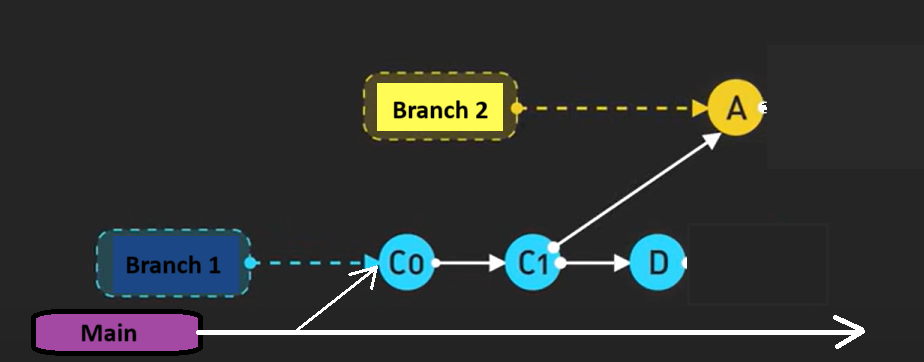

1. Git is a version control system that allows developers to keep track of changes made to their code over time, while GitLab is a web-based Git repository manager. 
2. GitHub, GitLab, and BitBucket are the three most popular Git repository services. GitHub excels in UI, ease of use, and community support, while GitLab offers the most robust DevSecOps tools but a less active community. BitBucket is ideal for teams deeply integrated with Jira, Confluence, or the Atlassian ecosystem.
3. One might choose to use Git without GitLab if they want to host their repositories on a different platform, like GitHub or Bitbucket, or if they prefer to self-host their own Git server.
4. To update your GitLab server, commit your local changes with git add . and git commit -m "message", then push them using git push origin "branch". Make sure to pull the latest changes from the server first using git pull to avoid conflicts.
5. A branch in Git is a separate line of development that allows you to work on features, fixes, or experiments without affecting the main codebase.
6. 
7. When the same file is modified differently in both main and feature-branch. Git cannot automatically determine which change should be kept, resulting in a merge conflict.
8. Yes, Git is suitable for LaTeX documents.
9. No, Git is not ideal for versioning Word and PowerPoint files because they are binary files, making it hard to track changes effectively. Instead, consider using OneDrive, Google Drive, or a dedicated document management system that supports version history.
10. Git will reject your push due to the fact that new commits have been added to the remote since your last pull.
11. If you pull without committing your local changes first, Git will attempt to merge your uncommitted changes with the changes from the remote. If there are conflicts, Git will prevent the merge and ask you to resolve them before proceeding.
12. Branching creates a separate line of development within the same repository, allowing you to work on changes without affecting the main codebase. Forking creates a copy of a repository under your account, enabling independent changes.